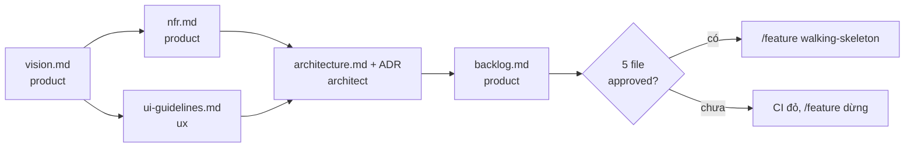

# Thiết kế: `/init-project` và cổng chặn

Bản thiết kế chi tiết cho [ADR-0007](../adr/0007-project-foundation-gate.md). Trạng thái: **đã duyệt** ngày 2026-10-02, mọi câu hỏi ở [mục 9](#9-câu-hỏi-cần-quyết) chọn theo đề xuất.

## 1. Mục tiêu

- Trước feature đầu tiên, dự án có đủ các quyết định nền: phục vụ ai, đạt chất lượng gì, trông thế nào, xây ra sao, làm gì trước.
- Các quyết định đó được người duyệt và **máy kiểm được**, không dựa vào trí nhớ.
- Agent đọc các quyết định đó khi làm feature, và dừng lại hỏi khi thiếu quyết định thay vì tự giả định.

## 2. Luồng tổng quát



Mỗi mũi tên là "file sau đọc file trước". Sau mỗi file có một trạm duyệt của người.

## 3. Năm tài liệu nền

Tất cả nằm trong `docs/project/`, viết tiếng Việt, có phần đầu:

```yaml
---
status: draft            # draft | approved
approved_by:             # tên người duyệt, để trống khi draft
approved_on:             # YYYY-MM-DD, để trống khi draft
---
```

Mỗi file có mục **Câu hỏi mở** ở cuối: câu hỏi chưa trả lời được phép tồn tại nếu có **hạn chót** dạng "trước feature `<tên>`" hoặc một ngày cụ thể.

### 3.1 `vision.md` (agent `product`)

| Mục | Nội dung |
|---|---|
| Mục đích | Blog tồn tại để làm gì, một đoạn |
| Độc giả | Ai đọc (tuổi, nghề, nhu cầu), đọc bằng thiết bị gì, đọc trong hoàn cảnh nào. 1–3 chân dung độc giả (persona) |
| Thành công | Đo bằng gì: số người đọc, thời gian đọc, người quay lại... và mức mong muốn |
| Nội dung | Loại bài, tần suất đăng, ai viết, viết bằng công cụ gì |
| Phạm vi | Những gì blog có |
| Ngoài phạm vi | Những gì blog cố ý không có (bình luận? đăng nhập độc giả? đa ngôn ngữ?) |
| Ràng buộc | Ngân sách, thời gian, pháp lý (dữ liệu cá nhân, bản quyền) |
| Rủi ro | Điều gì có thể làm dự án thất bại |

### 3.2 `nfr.md`: yêu cầu phi chức năng (agent `product`)

Mỗi dòng gồm: thuộc tính, **mức cần đạt** (đo được), **cách kiểm**.

| Thuộc tính | Ví dụ mức cần đạt | Ví dụ cách kiểm |
|---|---|---|
| Hiệu năng | Trang bài viết tải xong nội dung chính dưới 2,5 giây trên 4G | Lighthouse trong CI |
| Tiếp cận (accessibility) | WCAG 2.2 mức AA | axe trong acceptance test |
| Thiết bị | Đọc tốt từ màn hình 360px tới 1920px | Playwright chụp ở nhiều cỡ |
| SEO | Mỗi trang có title, description, URL ổn định | Test kiểm thẻ meta |
| Bảo mật | Theo OWASP Top 10; trang quản trị (nếu có) phải đăng nhập | CodeQL, review bảo mật |
| Khả dụng | Ví dụ 99% thời gian | Giám sát sau khi deploy |
| Quyền riêng tư | Có thu thập dữ liệu người đọc không, cookie gì | Review |
| Ngôn ngữ | Tiếng Việt; có cần tiếng Anh không | — |

### 3.3 `ui-guidelines.md` (agent `ux`)

| Mục | Nội dung |
|---|---|
| Nguyên tắc | 3–5 nguyên tắc thiết kế rút ra từ độc giả (ví dụ: chữ to, tương phản cao, ít trang trí) |
| Design tokens | Màu (kèm tỉ lệ tương phản), font (phải hỗ trợ tiếng Việt có dấu), thang cỡ chữ, line-height, thang khoảng cách, bo góc |
| Layout | **Độ rộng tối đa vùng đọc**, breakpoint, header, menu, footer |
| Thành phần | Link, nút, thẻ bài viết, danh sách bài, form; trạng thái hover và focus |
| Ảnh | Tỉ lệ, cỡ tối đa, văn bản thay thế (alt) |
| Cách kiểm | Luật nào kiểm tự động được (tương phản, độ rộng, focus) và kiểm bằng gì |

Tokens được viết sao cho chuyển thẳng thành biến CSS trong walking skeleton.

### 3.4 `architecture.md` (agent `architect`, chế độ dự án)

- Sơ đồ ngữ cảnh và sơ đồ khối theo mô hình C4, mức 1 và 2.
- Cấu trúc tầng trong code (controller, service, data).
- Danh sách quyết định lớn, mỗi quyết định **một ADR** trong `docs/adr/`, với 2–3 phương án để người chọn:
  - Lưu bài viết: database hay file Markdown trong repo.
  - Có trang quản trị và đăng nhập không, nếu có thì cách nào.
  - Cấu trúc URL (ví dụ `/bai-viet/<slug>` hay `/posts/<id>`).
  - Nơi deploy.
  - Database trên CI (thay phần còn mở của ADR-0003).
- Mục "Chưa quyết", có hạn chót.

`architecture.md` mô tả **hiện trạng**; lý do nằm trong ADR.

### 3.5 `backlog.md` (agent `product`)

| Mã | Tên feature | Mô tả | Phụ thuộc | Câu hỏi mở cần trả lời trước | Trạng thái | PR |
|---|---|---|---|---|---|---|
| F-00 | `walking-skeleton` | Layout chung theo ui-guidelines, CSS nền, `public partial class Program` | — | — | todo | |
| F-01 | `about` | Trang Giới thiệu | — | — | done | #1 |
| F-02 | ... | | F-00 | | todo | |

- **Tên feature** là đúng tên dùng cho `/feature` và thư mục `docs/features/<tên>/`.
- F-00 luôn là walking skeleton và phải `done` trước mọi feature nội dung.

## 4. Agent

| Agent | Mới hay sửa | Đọc | Viết | Dừng (`BLOCKED`) khi |
|---|---|---|---|---|
| `product` | Mới | Yêu cầu của người, các file nền đã có | `vision.md`, `nfr.md`, `backlog.md` | Còn câu hỏi người phải trả lời |
| `ux` | Mới | `vision.md`, `nfr.md` | `ui-guidelines.md` | Còn câu hỏi về phong cách, màu, font |
| `architect` | Sửa: thêm chế độ dự án | `vision.md`, `nfr.md`, `ui-guidelines.md`, ADR hiện có | `architecture.md`, ADR mới ở trạng thái `Proposed` | Cần người chọn phương án |
| `ba` | Sửa | Thêm `vision.md`, `backlog.md`, `nfr.md` | (không đổi) | Feature không có trong `backlog.md` ở trạng thái `todo`; phụ thuộc chưa `done`; câu hỏi mở liên quan chưa trả lời; cần quyết định cấp dự án chưa có |
| `architect` (chế độ feature) | Sửa | Thêm `architecture.md`, `ui-guidelines.md`, ADR | (không đổi) | Thiết kế cần một quyết định lớn chưa có ADR |
| `developer` | Sửa | Thêm `ui-guidelines.md` khi task đụng giao diện | (không đổi) | — |
| `reviewer` | Sửa | Thêm `ui-guidelines.md`, `nfr.md` | Thêm mục "Tuân thủ ui-guidelines và nfr" trong `04-review.md` | — |

**Cách agent "phỏng vấn" người:** subagent không nói chuyện trực tiếp với người được. Agent soạn nháp, ghi phần chưa biết vào mục Câu hỏi mở, rồi báo `BLOCKED: <danh sách câu hỏi>`. Skill chuyển câu hỏi cho người, nhận câu trả lời, gọi lại agent kèm câu trả lời. Tối đa 3 vòng hỏi mỗi file; quá thì dừng, để người tự sửa file.

**Agent không bao giờ ghi `status: approved`.**

## 5. Skill `/init-project`

Tham số: `[--from <vision|nfr|ui|architecture|backlog>]`.

**Chuẩn bị:**
1. Working tree sạch.
2. Tạo branch `chore/project-foundation` từ `main` (chạy tiếp thì chuyển sang branch đó).
3. Chưa có `docs/project/` hoặc đang chạy tiếp; có rồi mà không có `--from` thì dừng.

**Các bước** (mỗi bước: gọi agent → vòng hỏi đáp nếu `BLOCKED` → trạm duyệt → commit):

| Bước | Agent | File | Commit |
|---|---|---|---|
| 1 | `product` | `vision.md` | `docs(project): vision` |
| 2 | `product` | `nfr.md` | `docs(project): non-functional requirements` |
| 3 | `ux` | `ui-guidelines.md` | `docs(project): UI guidelines` |
| 4 | `architect` | `architecture.md` + ADR `Proposed` | `docs(project): architecture and ADRs` |
| 5 | `product` | `backlog.md` | `docs(project): backlog` |

**Trạm duyệt sau mỗi file:** skill tóm tắt file (các quyết định chính, câu hỏi mở và hạn chót), rồi chờ.
- Người gõ `duyệt` → skill ghi `status: approved`, `approved_by`, `approved_on`; với bước 4, đổi các ADR người đã chọn sang `Accepted`.
- Người góp ý → gọi lại agent kèm góp ý.
- Người tự sửa file → skill đọc lại và tóm tắt lại.

**Cuối cùng:** push branch, mở PR `docs(project): project foundation`, báo link. Người merge.

## 6. Cổng chặn

### 6.1 `/feature`, bước 0 (mới)

Trước mọi bước khác, kiểm năm file `docs/project/{vision,nfr,ui-guidelines,architecture,backlog}.md` đều tồn tại và có `status: approved`. Thiếu thì dừng, báo file nào thiếu và gợi ý `/init-project`.

### 6.2 CI: job `foundation-gate` (mới)

Script `scripts/check-foundation.sh`, chạy trong `ci.yml` như một job riêng:

1. Lấy danh sách file PR thay đổi: `git diff --name-only <base>...<head>`.
2. Nếu không có file nào trong `docs/features/` (trừ `docs/features/_template/`) thì **qua**.
3. Nếu có: kiểm năm file nền tồn tại và có dòng `status: approved` trong phần đầu. Thiếu file nào thì **đỏ**, in tên file và hướng dẫn chạy `/init-project`.
4. Với push lên `main` (không phải PR): luôn qua.

Thêm `foundation-gate` vào danh sách check bắt buộc của bảo vệ nhánh `main`.

### 6.3 Agent

Như bảng ở mục 4: `ba` và `architect` dừng khi thiếu quyết định; `reviewer` kiểm tuân thủ.

## 7. Sửa tài liệu nền sau khi đã duyệt

- Đi qua PR như mọi thay đổi.
- PR phải cập nhật `approved_on`, và người merge chính là người duyệt.
- Đổi một quyết định kiến trúc: viết ADR mới thay thế, cập nhật `architecture.md`.
- Thêm feature vào backlog: sửa `backlog.md` trong PR riêng hoặc ngay trong PR của feature trước đó.

## 8. Những gì sẽ được tạo hoặc sửa

| File | Việc | PR |
|---|---|---|
| `docs/project/_template/*.md` | Tạo: khung cho năm file | 1 |
| `.claude/agents/product.md`, `ux.md` | Tạo | 1 |
| `.claude/agents/architect.md` | Sửa: thêm chế độ dự án, đọc ADR | 1 |
| `.claude/skills/init-project/SKILL.md` | Tạo | 1 |
| `.claude/agents/ba.md`, `developer.md`, `reviewer.md` | Sửa: thêm đầu vào, luật dừng, mục tuân thủ | 2 |
| `.claude/skills/feature/SKILL.md` | Sửa: thêm bước 0 | 2 |
| `scripts/check-foundation.sh`, `.github/workflows/ci.yml` | Tạo, sửa: job `foundation-gate` | 2 |
| Bảo vệ nhánh `main` | Thêm check bắt buộc `foundation-gate` | 2 (sau merge) |
| `CONTRIBUTING.md`, `CLAUDE.md`, `README.md` | Sửa: mô tả giai đoạn khởi động | 1, 2 |
| ADR-0007 | Đổi `Proposed` → `Accepted` | 1 |
| `docs/project/*.md` | Tạo bằng cách chạy `/init-project` | 3 |

PR 1 và 2 sửa `.claude/`, nên cần chuyển sang chế độ Default để duyệt từng lần sửa. PR 3 là kết quả của việc chạy skill, cần người trả lời phỏng vấn.

## 9. Câu hỏi cần quyết

Người quyết định: Lê Khánh Trình, ngày 2026-10-02. **Quyết định: chọn theo đề xuất cho cả 9 câu.**

| # | Câu hỏi | Đề xuất (đã chọn) |
|---|---|---|
| Q1 | Năm file nền đã đủ chưa? Có thêm `glossary.md` (thuật ngữ Việt và Anh, để đặt tên code thống nhất) không? | Đủ năm file. `glossary.md` để sau, khi có domain rõ hơn |
| Q2 | Ai ghi `status: approved`? | Skill ghi, **chỉ** sau khi người gõ `duyệt` trong trạm duyệt. Phương án khác: người tự sửa phần đầu file |
| Q3 | Năm file trong một PR hay mỗi file một PR? | Một PR, vì các file phụ thuộc nhau; mỗi file một commit để dễ xem |
| Q4 | `foundation-gate` có thành check bắt buộc của `main` không? | Có. Không bắt buộc thì nó chỉ là cảnh báo |
| Q5 | Tài liệu nền viết bằng ngôn ngữ nào? | Tiếng Việt, giống `docs/features/` |
| Q6 | Feature `about` có được miễn cổng chặn không? | Không miễn. Sửa `about` cũng phải chờ năm file được duyệt; đơn giản và nhất quán |
| Q7 | Có hai agent mới `product` và `ux`, hay gộp vào `ba`? | Hai agent mới. `ba` làm việc ở tầng feature; trộn hai tầng vào một agent dễ lẫn đầu vào |
| Q8 | Tối đa bao nhiêu vòng hỏi đáp mỗi file? | 3 vòng |
| Q9 | Thứ tự làm | PR 1 → PR 2 → chạy `/init-project` (PR 3) → `/feature walking-skeleton` |
