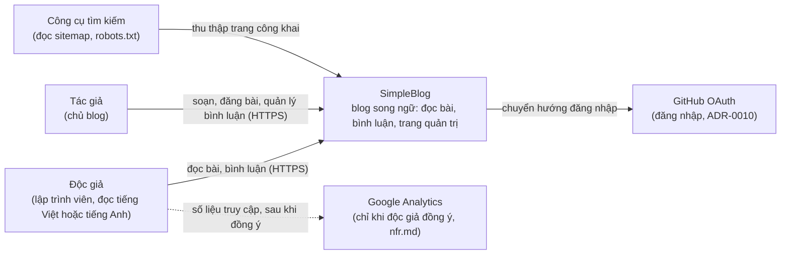
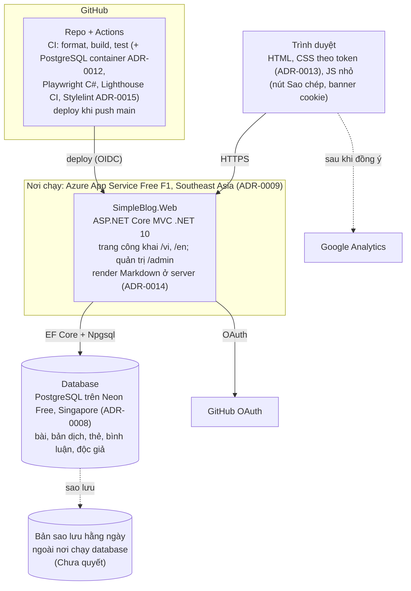

# Kiến trúc

<!-- File này mô tả hiện trạng. Lý do của từng quyết định lớn nằm trong docs/adr/. -->

## Tóm tắt cho người duyệt

- Blog vẫn là **một web app ASP.NET Core MVC duy nhất** cộng một database. Không thêm project, không tách dịch vụ.
- Bạn đã chọn cả 8 câu hỏi (ADR-0008 đến ADR-0015). Các ADR vẫn ở trạng thái `Proposed` cho tới khi bạn duyệt file này; mục "Quyết định" bên dưới ghi đúng các lựa chọn đó.
- Thay đổi lớn nhất: **đổi từ SQL Server sang PostgreSQL**, chạy trên **Neon gói miễn phí** (ADR-0008). Lý do: database SQL Server miễn phí trên Azure ngủ và thức dậy chậm, lại có thể hết hạn mức giữa tháng, trượt yêu cầu "thức dậy ≤ 15 giây". Máy dev cài PostgreSQL thay LocalDB; test dùng database `simpleblog_test`.
- Chạy web trên **Azure App Service gói miễn phí F1** (ADR-0009); đăng nhập bằng **GitHub** cho cả bạn và độc giả, không lưu mật khẩu (ADR-0010).
- URL có **tiền tố ngôn ngữ**: `/vi/posts/<slug>`, `/en/posts/<slug>`; slug không đổi khi sửa tiêu đề (ADR-0011).
- **Bỏ Bootstrap và jQuery**, viết CSS riêng theo design tokens đã duyệt, để trang nhẹ (ADR-0013). Bài viết bằng **Markdown**, chuyển sang HTML ở server (ADR-0014).
- Test trình duyệt viết bằng **C# với Playwright**, cùng project test hiện có (ADR-0015); CI có PostgreSQL chạy trong container (ADR-0012).
- Các quyết định này kéo theo việc sửa một số file khác (README, CLAUDE.md, các agent, CI...), liệt kê ở mục "Việc phải làm theo các quyết định"; chúng làm trong PR riêng, không làm trong PR tài liệu nền này.
- Các việc hoãn có hạn chót: sao lưu, tên miền riêng, tô sáng code, lưu ảnh, tìm kiếm, giám sát, analytics (mục "Chưa quyết").

## Ngữ cảnh

Sơ đồ mức 1 (C4 Context): hệ thống, người dùng, hệ thống bên ngoài.

## Các khối chính

Sơ đồ mức 2 (C4 Container).

Hiện trạng thực tế (2026-10-05): chỉ có khối `SimpleBlog.Web` chạy trên máy dev với trang Giới thiệu; chưa có database, đăng nhập, deploy hay analytics. CI hiện chạy format, build, test trên Ubuntu (ADR-0003). Sơ đồ trên là đích đến theo các ADR 0008 đến 0015.

## Cấu trúc code

**Hiện tại.** Một solution `SimpleBlog.slnx`, hai project:

- `src/SimpleBlog.Web`: khung `dotnet new mvc`. `Program.cs` (minimal hosting, route mặc định `{controller=Home}/{action=Index}/{id?}`), `Controllers/HomeController.cs`, `Models/ErrorViewModel.cs`, `Views/`, `wwwroot/` (có Bootstrap, jQuery, jquery-validation trong `wwwroot/lib`, sẽ bỏ theo ADR-0013). Đã có package EF Core SqlServer và Design nhưng chưa có DbContext; SqlServer sẽ thay bằng Npgsql theo ADR-0008. `Program` đang là `internal`.
- `tests/SimpleBlog.Tests`: xUnit v2, `Unit/` cho unit test, `Acceptance/<Feature>/` cho acceptance test qua `WebApplicationFactory`. Test trình duyệt Playwright C# cũng nằm trong `Acceptance/<Feature>/` (ADR-0015).

**Các tầng trong `src/SimpleBlog.Web`** (vẫn một project, theo quy ước MVC có sẵn, không thêm repository hay mediator):

| Thư mục | Chứa gì | Được phụ thuộc vào |
|---|---|---|
| `Controllers/` | Controller trang công khai | `Services/`, `Data/`, `Models/` |
| `Areas/Admin/` | Controller và view trang quản trị (khu vực MVC có sẵn), mọi controller có policy tác giả | `Services/`, `Data/`, `Models/` |
| `Views/`, `Areas/Admin/Views/` | Razor view, layout chung | Chỉ `Models/` (view model) và localizer |
| `Models/` | View model, input model của form | Không phụ thuộc tầng nào khác của app |
| `Services/` | Logic không thuộc một controller: chuyển Markdown, tạo slug, quyền tác giả | `Data/` |
| `Data/` | `DbContext`, entity, cấu hình EF | Không phụ thuộc tầng nào khác của app |
| `Migrations/` | Migration EF Core (PostgreSQL) | `Data/` |
| `Resources/` | File `.resx` chuỗi giao diện `vi` và `en` | (dữ liệu) |
| `wwwroot/css/tokens.css`, `site.css`; `wwwroot/js/` | Token, CSS, JS nhỏ (ADR-0013) | (tĩnh) |

Luật phụ thuộc:

- Chiều phụ thuộc chỉ đi xuống: Controllers → Services → Data. `Data/` và `Models/` không tham chiếu Controllers, Services hay Views.
- View không truy cập `DbContext` và không nhận entity; controller chuyển entity sang view model.
- Controller được dùng thẳng `DbContext` cho truy vấn đơn giản; chỉ tách ra `Services/` khi logic dùng lại ở nhiều nơi hoặc cần unit test riêng.
- `DbContext` đăng ký bằng `AddDbContext<T>((sp, options) => ...)`, đọc connection string từ `sp.GetRequiredService<IConfiguration>()` lúc tạo, gọi `options.UseNpgsql(...)`, để acceptance test ghi đè được sang database test `simpleblog_test` (ADR-0012).
- `Program` là `public partial class Program` (sửa trong walking skeleton) để test dùng `WebApplicationFactory<Program>` trực tiếp.
- Chuỗi giao diện lấy qua localizer từ `Resources/`, không viết cứng (`nfr.md`). Để HTML chứa chữ tiếng Việt thật thay vì `&#x...;`, cấu hình `WebEncoderOptions` cho phép ký tự Unicode (ADR-0011, Hệ quả).
- Form kiểm tra ở server (model validation); không có kiểm tra phía trình duyệt bằng jQuery (ADR-0013).

## Quyết định

Các dòng dưới là lựa chọn của người dùng ngày 2026-10-05. ADR tương ứng chuyển `Accepted` khi file này được duyệt.

| Chủ đề | Quyết định | ADR |
|---|---|---|
| Lưu bài viết | PostgreSQL trên Neon Free (Singapore) qua EF Core provider Npgsql. Dev: PostgreSQL cục bộ, database `simpleblog`; test: `simpleblog_test`. Bỏ SQL Server LocalDB | [ADR-0008](../adr/0008-post-storage-database.md) |
| Trang quản trị và đăng nhập | Đăng nhập GitHub (OAuth) cho cả tác giả và độc giả, cookie của ASP.NET Core, không dùng Identity, không lưu mật khẩu; tác giả xác định bằng mã GitHub trong cấu hình; trang quản trị ở khu vực `Admin`, policy `Author` | [ADR-0010](../adr/0010-authentication.md) |
| Cấu trúc URL | Tiền tố ngôn ngữ cho cả hai `/vi/...`, `/en/...`; bài `/{lang}/posts/{slug}`, slug cố định, đổi slug thì 301; `/admin`, `/account`, `/sitemap.xml`, `/robots.txt` không tiền tố | [ADR-0011](../adr/0011-url-structure-and-language.md) |
| Nơi deploy | Azure App Service Free F1, Southeast Asia, deploy từ GitHub Actions bằng OIDC khi push `main`; secret production trong app settings | [ADR-0009](../adr/0009-hosting.md) |
| Database trên CI | PostgreSQL service container trên runner Ubuntu, connection string test qua biến môi trường của workflow | [ADR-0012](../adr/0012-database-on-ci.md) |
| CSS | CSS tự viết theo design tokens (`tokens.css`, `site.css`), bỏ Bootstrap, jQuery, jquery-validation; kiểm tra form ở server | [ADR-0013](../adr/0013-css-approach.md) |
| Định dạng nội dung bài | Markdown lưu trong database, chuyển HTML ở server bằng Markdig, tắt HTML thô, chặn scheme URL lạ, tô sáng code ở server | [ADR-0014](../adr/0014-post-content-format.md) |
| Công cụ kiểm giao diện | Playwright C# và axe-core trong `tests/SimpleBlog.Tests`; Lighthouse CI và Stylelint bằng Node chỉ trong CI | [ADR-0015](../adr/0015-ui-test-tooling.md) |
| Đa ngôn ngữ giao diện | Localization có sẵn của ASP.NET Core, ngôn ngữ lấy từ route, chuỗi trong `.resx` (đi kèm ADR-0011) | [ADR-0011](../adr/0011-url-structure-and-language.md) |
| Quy trình, CI, chất lượng code, mã hóa file | Đã chốt | [ADR-0002](../adr/0002-protected-main-squash-only.md), [ADR-0003](../adr/0003-ci-on-github-actions-ubuntu.md), [ADR-0004](../adr/0004-agent-pipeline-with-human-gates.md), [ADR-0005](../adr/0005-line-endings-and-encoding.md), [ADR-0006](../adr/0006-code-quality-gates.md), [ADR-0007](../adr/0007-project-foundation-gate.md) |

### Việc phải làm theo các quyết định

Không làm trong PR tài liệu nền; mỗi nhóm một PR `chore` (hoặc nằm trong walking skeleton), trước feature đầu tiên cần tới nó.

| Việc | File | Theo ADR | Hạn chót |
|---|---|---|---|
| Đổi luật database cho agent: PostgreSQL `localhost`, database test `simpleblog_test` thay `(localdb)\MSSQLLocalDB` / `SimpleBlog_Test`; fixture tester kiểm tên database `simpleblog_test`; bỏ "EF Core SqlServer" trong ràng buộc thiết kế của architect | `.claude/agents/ba.md`, `architect.md`, `developer.md`, `reviewer.md`, `tester.md` (PR riêng, người duyệt từng chỗ sửa) | 0008, 0012 | Trước feature đầu tiên dùng database |
| Đổi mục Database, Current state; cập nhật mục "Vietnamese text in Razor" khi bật `WebEncoderOptions` | `CLAUDE.md` | 0008, 0011 | Cùng PR trên; phần Razor khi làm localization |
| Đổi yêu cầu cài đặt (PostgreSQL thay LocalDB), lệnh `ef`, mục Kỹ thuật (connection string, Playwright, Node chỉ trên CI) | `README.md` | 0008, 0015 | Cùng PR đổi provider |
| Bỏ đoạn về LocalDB trên CI, ghi PostgreSQL container | `CONTRIBUTING.md` | 0012 | Cùng PR sửa CI |
| Connection string dev có mật khẩu: đặt bằng user-secrets, không ghi vào `appsettings*.json` | `SECURITY.md`, `src/SimpleBlog.Web/appsettings.Development.json` | 0008 | Cùng PR đổi provider |
| Thay package `Microsoft.EntityFrameworkCore.SqlServer` bằng `Npgsql.EntityFrameworkCore.PostgreSQL` | `src/SimpleBlog.Web/SimpleBlog.Web.csproj` | 0008 | Cùng PR đổi provider |
| Thêm `services: postgres`, biến môi trường connection string test, cài trình duyệt Playwright, job Lighthouse CI và Stylelint; thêm workflow deploy | `.github/workflows/ci.yml`, workflow deploy mới, `package.json` cho công cụ | 0009, 0012, 0015 | CI database: trước feature đầu tiên dùng database; deploy: trước lần deploy đầu |
| Xóa `wwwroot/lib/bootstrap`, `wwwroot/lib/jquery*`, viết lại `_Layout.cshtml`, `site.css`, thêm `tokens.css` | `src/SimpleBlog.Web/wwwroot/`, `Views/Shared/` | 0013 | Walking skeleton |
| Đánh dấu câu hỏi mở 1 (Bootstrap) đã trả lời bởi ADR-0013 | `docs/project/ui-guidelines.md` (cập nhật `approved_on`) | 0013 | Cùng PR tài liệu nền hoặc ngay sau |
| Sửa dòng "SQL Server LocalDB khi phát triển" và hai rủi ro về SQL Server, LocalDB | `docs/project/vision.md` | 0008, 0012 | Cùng PR tài liệu nền hoặc ngay sau |
| Ghi ADR-0003 "Phần việc còn mở được trả lời bởi ADR-0012" (chỉ dòng trạng thái) | `docs/adr/0003-ci-on-github-actions-ubuntu.md` | 0012 | Khi ADR-0012 chuyển Accepted |
| Mục 4.1 "SQL Server trong container" đổi thành PostgreSQL | `docs/process-roadmap.md` | 0012 | Cùng PR sửa CI |
| Thêm thuật ngữ: PostgreSQL, Neon, Npgsql, OAuth, OIDC, App Service, slug, Markdown/Markdig, Playwright, axe-core, Lighthouse CI, Stylelint, service container, design token (nếu chưa có); sửa dòng LocalDB và ví dụ Bootstrap | `docs/glossary.md` | Tất cả | Cùng PR tài liệu nền (PRC-06) |
| Kiểm lại agent `ux` (đang nhắc Bootstrap mặc định là hiện trạng) | `.claude/agents/ux.md` | 0013 | Sau walking skeleton |

## Chưa quyết

Hoãn có chủ đích (Last Responsible Moment: quyết lúc muộn nhất mà chưa tốn thêm chi phí). Mỗi mục cần ADR riêng khi tới hạn.

| Chủ đề | Vì sao hoãn được | Hạn chót |
|---|---|---|
| Sao lưu hằng ngày database Neon ra ngoài Neon (công cụ, nơi lưu, mã hóa vì có dữ liệu cá nhân) | Chưa có dữ liệu thật | Trước khi đăng bài đầu tiên công khai (`nfr.md` yêu cầu thử khôi phục trước mốc này) |
| Tên miền riêng | Đổi tên miền sau khi có bài công khai làm đổi mọi URL (cần 301); gói F1 không gắn được tên miền riêng | Trước khi đăng bài đầu tiên công khai |
| Thư viện tô sáng cú pháp ở server | Chỉ cần khi hiển thị khối code; phải kiểm đủ tương phản theo token | Trước feature hiển thị chi tiết bài |
| Nơi lưu ảnh tải lên | Phụ thuộc câu hỏi mở 6 của vision | Trước feature `post-editor` |
| Cách tìm kiếm (full-text của PostgreSQL hay khác) | Phụ thuộc câu hỏi mở 8 của vision | Trước feature `search` |
| Dịch vụ giám sát miễn phí (kiểm trang chủ mỗi 60 phút, `nfr.md`) | Chỉ cần khi đã deploy | Trước lần deploy production đầu tiên |
| ADR cho Google Analytics | `nfr.md` đã chọn Google Analytics nhưng câu hỏi mở 6 của `nfr.md` có thể đổi sang dịch vụ khác | Trước feature `analytics` |

## Câu hỏi mở

| Câu hỏi | Hạn chót | Ai trả lời |
|---|---|---|
| Thời gian thức dậy thực tế của App Service F1 cộng Neon (`nfr.md`, ≤ 15 s); vượt thì xem lại ADR-0009 (chuyển Azure Container Apps) | Sau lần deploy đầu tiên; ghi kết quả vào file này | Người deploy |
| Điều khoản gói miễn phí của Neon và App Service F1 còn đúng như ADR-0008, ADR-0009 ghi không (agent chưa mở trực tiếp được nguồn) | Trước lần deploy đầu tiên | Người deploy |
